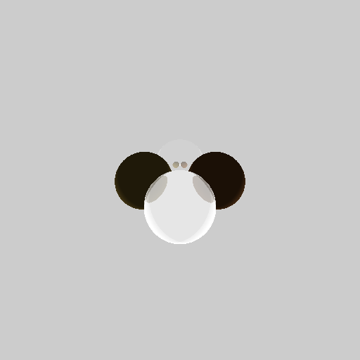

This is just a case of study in CUDA, the raytracing implemented here is REALLY basic, based on a previous university project totally implemented on CPU. The 'master' branch contains the raytracing CUDA implementation and the 'no_cuda' contains the basic CPU one.

Just an example:

    

